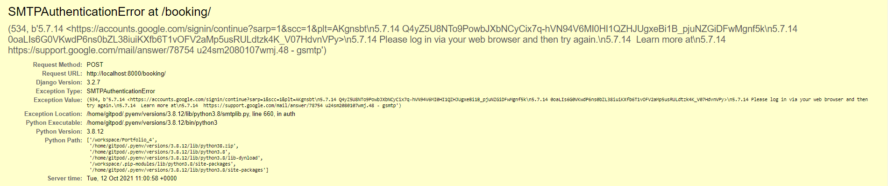

# Testing

## User Story Testing

1. As a {USER}, I want {TO CONTACT THE PRODUCER}, so that {I CAN GET THEM TO WORK ON MY MUSIC}.
    <details>
    <summary>Achieve by...</summary>
    <br>
    </details>

2. As a {admin}, I want {TO BE ABLE TO VIEW/MANAGE SUBMITTED INFO}, so that {I CAN KEEP CONTROL OVER THEM}.
    <details>
    <summary>Achieve by...</summary>
    <br>
    </details>

3. As a {user and admin}, I want {TO RECEIVE AN EMAIL CONFIRMING MY SUBMISSION}, so that {I CAN BE INFORMED WHEN IT GOES THROUGH}.
    <details>
    <summary>Achieve by...</summary>
    <br>
    </details>

4. As a {USER}, I want {TO UPLOAD A LINK TO MY FILES}, so that {THE ADMIN CAN DOWNLOAD THEM}.
    <details>
    <summary>Achieve by...</summary>
    <br>
    </details>

5. As a {ADMIN}, I want {TO BE ABLE TO SEND THE USERS THEIR FILES}, so that {THEY CAN HAVE THE FINISHED PROJECT}.
    <details>
    <summary>Achieve by...</summary>
    <br>
    </details>

6. As a {ADMIN}, I want {TO BE ABLE TO DOWNLOAD THE USERS STEMS}, so that {I CAN WORK ON THEIR PROJECT}.
    <details>
    <summary>Achieve by...</summary>
    <br>
    </details>

8. As a {user}, I want {a page I can go to with all the info about my appointment}, so that {I can cancel, reschedule or remind myself about my appointment info}.
    <details>
    <summary>Achieve by...</summary>
    <br>
    </details>

9. As a {USER}, I want {TO SEE TESTIMONIALS FROM PAST CLIENTS}, so that {I CAN SEE WHAT PEOPLE ARE SAYING BEFORE I HIRE THE PRODUCER}.
    <details>
    <summary>Achieve by...</summary>
    <br>
    </details>

10. As a {ADMIN}, I want {THE SUBMISSIONS REVIEW PAGE TO BE PRIVATE}, so that {REGULAR USERS CANT SEE/DOWNLOAD OTHERS FILES}.
    <details>
    <summary>Achieve by...</summary>
    <br>
    </details>

11. As a {USER}, I want {SITE MESSAGES UPON SITE ACTIONS}, so that {I CAN GET FEEDBACK IF I HAVE CORRENTLY OR INCORRECTLY USED THE SITE}.
    <details>
    <summary>Achieve by...</summary>
    <br>
    </details>


## Bugs

- Upon deployment to heroku and opening the app, the user would be presented with an application error.

    <details>
    <summary>Solution</summary>
    <br>
    The config var containing the Cloudinary link still contained "CLOUDINARY_URL=" in the value. Once this was removed the application booted properly.
    </details>

- When trying to set up the ```send_mail()``` I was receiving an SMTPAuthenticationError (see screenshot).

    

    <details>
    <summary>Solution</summary>
    <br>
    This was solved firstly by going to my google account and turning on the setting `Allow Less Secure Apps'. I then had to go [here](https://g.co/allowaccess) to unblock the app and allow it to log. 
    </details>

- When creating the login and signup templates, they would render without the custom CSS with the following terminal error 
```Refused to apply style from <URL> because its MIME type ('text/html') is not a supported stylesheet MIME type, and strict MIME checking is enabled angular```
    <details>
    <summary>Solution</summary>
    <br>
    Providing `````` at the beginning of base.html using template tags instead of manually writing the css path caused the css to render. This required me to go through 
    all of the existing media and switch it to a static link as well. 
    </details>

- Messages are meant to be displayed upon login or a failed login attempt. Login was successful as proven by the admin page opening up on the logged in profile, but the messages for failed login would not display on the login page 
    <details>
    <summary>Solution</summary>
    </details>

- This isn't necessarily a bug but due to Django's default User model using the username field to identify a user and the email field not being unique, multiple users are able to signup using the same email. Ideally both the username and the email would be unique.
    <details>
    <summary>Solution</summary>
    </details>